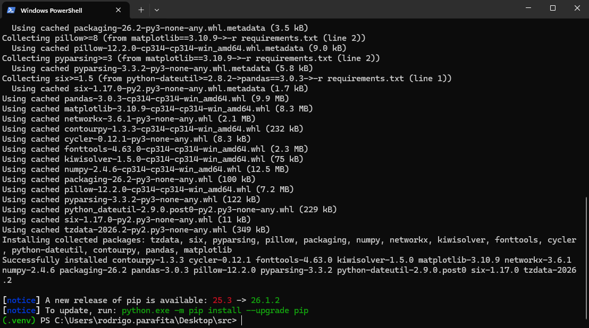
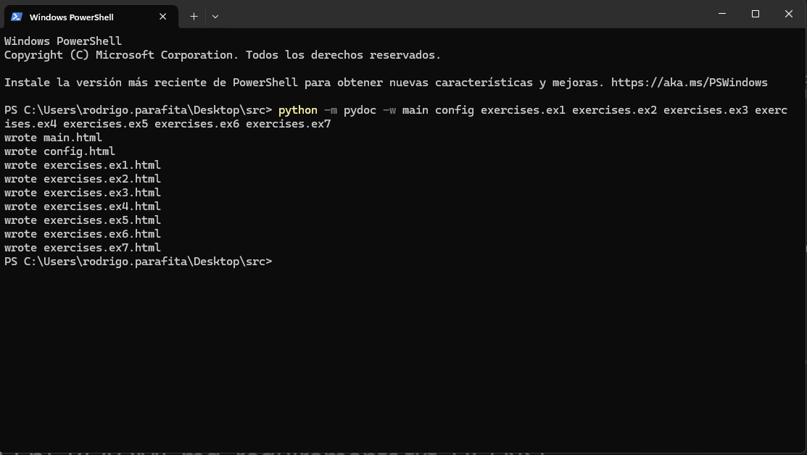
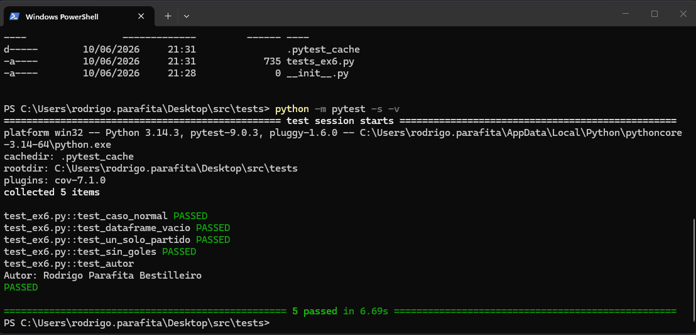

# Análisis de datos h istóricos de LaLiga entre 1995-2025

** Autor**: Rodrigo Parafita Bestilleiro

Este proyecto se fundamenta en el análisis de los resultados históricos de los partidos disputados en todas las temporadas de LaLiga comprendidas entre 1995 y 2025. Como primera fase, se llevará a cabo un proceso de tratamiento y depuración de datos con el objetivo de obtener un conjunto de datos consistente, estructurado y apto para el análisis. Una vez preparado el dataset, se realizarán diferentes análisis exploratorios y estadísticos que permitirán identificar patrones, tendencias y comportamientos relevantes a lo largo de las distintas temporadas. Además, el proyecto contará con un diseño profesional para su implementación donde se requierá.

## Estructura del proyecto

src/
├── data/                 # Datos de entrada
├── doc/                  # Documentación generada (pydoc)
├── exercises/            # Ejercicios
│   ├── ex1.py ... ex7.py
│   ├── ex2.PY
│   ├── ex3py
│   ├── ex4.py
│   ├── ex5.py
│   ├── ex6.py
│   ├── ex7.py
│   └── notebook_src.ipynb# Notebook de desarrollo de los ejercicios 
├── img/                  # Imágenes
├── screenshots/          # Capturas de pantalla
├── tests/                # Tests (pytest)
├── config.py             # Configuración
├── main.py               # Punto de entrada
├── requirements.txt      # Dependencias del proyecto
├── LICENSE               # Licencia (MIT)
├──  README.md

## Instalación del proyecto

El proyecto se instala a partir del fichero `requirements.txt` en un entorno virtual (venv) limpio.

#### 1.Crear el entorno virtual
- Abrir la terminal del ordenador
- Ejecutar la línea: `python -m venv .venv`

#### 2. Activación del entorno
- Ejecutar la línea: `.venv\Scripts\Activate.ps1`

#### 3. Instalar las librerias del archivo requirements
- Ejecutar la línea: `pip install -r requirements.txt`

Si el entorno virtual se creó correctamente la línea de comandos en tu terminal aparecerá precedida de la palabra (.venv) (mayoritariamente de veces de color verde)

**Nota (Windows):** si al activar el entorno aparece un error de "ejecución de scripts deshabilitada", ejecutar una vez:
`Set-ExecutionPolicy -Scope CurrentUser -ExecutionPolicy RemoteSigned`

## Ejecución del proyecto

Despues de activar el entorno virtual, el proyecto se ejecuta desde `main.py`
#### Ejecutar del ejercicio 1 al 7 (todos)
`python main.py -ex 7`

Por ejemplo, `-ex 5` ejecutaría únicamente los ejercicios del 1 al 5:

`python main.py -ex 5`

El argumento `-ex` es obligatorio; si se omite, el programa mostrará un mensaje de error indicando su uso.

## Comprobación del análisis estático

Se usará la librería pylint, esta no va incluída en el `requirements.txt`.

#### 1.Instalar la librería pylint
`pip install pylint`

#### 2. Ejecutar el análisis de los archivos .py
`pylint exercises/ex*.py`

OJO: Con la ejecución de ese código se realizará el análisis de todos los archivos ex.py, si se desea ir uno por uno solo hay que sustituir * por el número del archivo que queremos analizar.
Pylint asigna una puntuación sobre 10 de la estructura del código y el estilo usado. Posteriormente arroja aquellos puntos que pueden ser modificados y mejorados.

## Generación de la documentación

La documentación del proyecto se genera con **pydoc**, incluido en la librería estándar de Python (no requiere instalación).

Desde la carpeta raíz del proyecto, se genera un fichero HTML por cada módulo:

`python -m pydoc -w main config exercises.ex1 exercises.ex2 exercises.ex3 exercises.ex4 exercises.ex5 exercises.ex6 exercises.ex7`

Los archivos se generaron en la carpeta raíz del proyecto pero fueron movidos manualmente a la carpeta correspondiente doc, para seguir una estructura adecuada del proyecto.
Los ficheros `.html` generados contienen la documentación de cada módulo a partir de sus docstrings.

## Comprobación de los tests

Los tests del proyecto se ejecutan con **pytest**.

#### Instalar pytest en el entorno virtual
pip install pytest

#### Ejecutar los tests desde la raíz del proyecto
`pytest`

Para obtener una salida más detallada de cada test:

`pytest -v`

pytest detecta automáticamente los tests ubicados en la carpeta `tests/`.

El resultado del test realizado para el ejercicio 6 fue:

## Licencia

Este proyecto se distribuye bajo la licencia MIT. Consulta el fichero [LICENSE](LICENSE) para más detalles.

